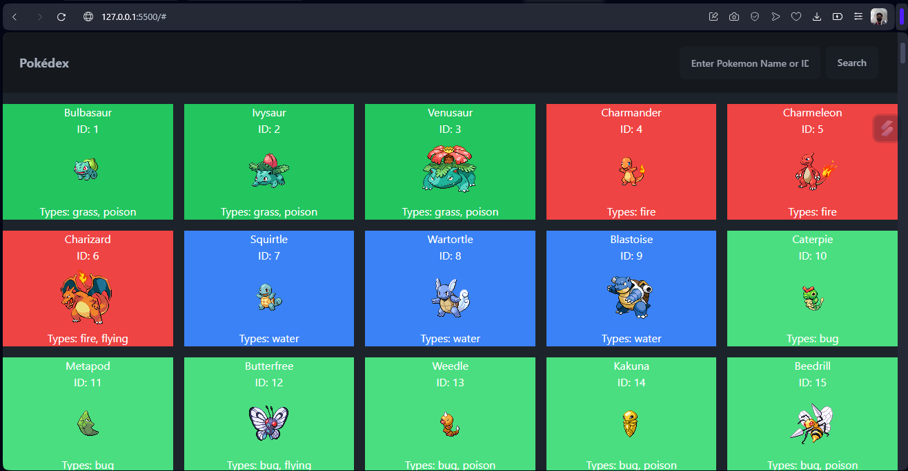
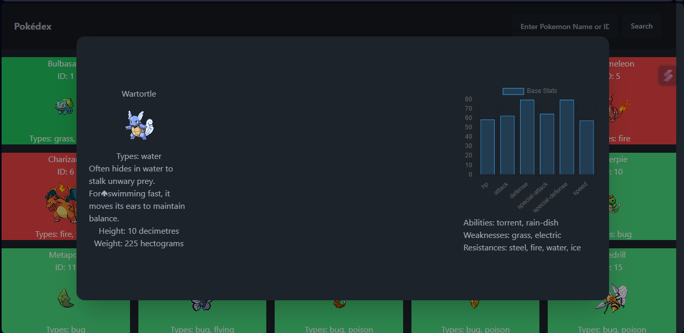

# Pokédex Website

## Description

This website is a Pokédex, a digital encyclopedia created by the user, for Pokémon trainers to search for information about various Pokémon species.

## Features

- Search for Pokémon by name
- Display Pokémon sprites and basic information
- Show detailed information for each Pokémon, including stats, abilities, and weaknesses
- Dynamic dropdown list of Pokémon names while typing in the search input
- Modal popup for detailed Pokémon information

## Technologies Used

- HTML
- JavaScript
- CSS
- PokeAPI for Pokémon data
- Tailwind CSS for styling
- DaisyUI for dropdown functionality
- Chart.js for displaying Pokémon stats

## Screenshots

### Main Screen

##

## Info Modal

